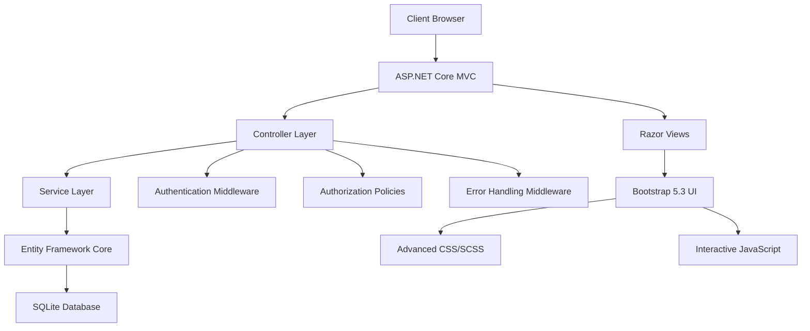
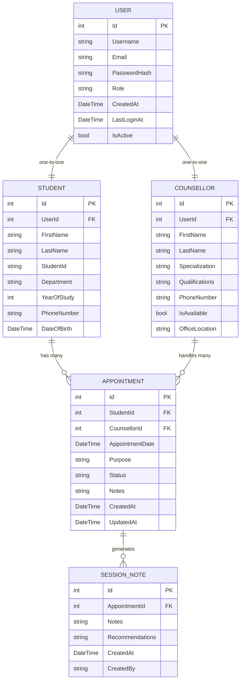

# 🎓 Student Counselling Application

<div align="center">
  
  
  
  
  
  
</div>

<div align="center">
  <h3>🌟 A Modern, Comprehensive Student Counselling Platform</h3>
  <p><em>Empowering students with advanced academic support, career guidance, and mental health resources through cutting-edge technology and intuitive design.</em></p>
</div>

---

## 📋 Table of Contents

- [🚀 Project Overview](#-project-overview)
- [✨ Key Features](#-key-features)
- [🏗️ Architecture & Design Patterns](#️-architecture--design-patterns)
- [🗂️ Project Structure](#️-project-structure)
- [💾 Database Design](#-database-design)
- [🎯 Core Modules](#-core-modules)
- [🔧 Installation & Setup](#-installation--setup)
- [🚀 Getting Started](#-getting-started)
- [🎨 Frontend Technologies](#-frontend-technologies)
- [🔐 Security Features](#-security-features)
- [📈 Performance Optimizations](#-performance-optimizations)
- [🧪 Testing](#-testing)
- [📚 API Documentation](#-api-documentation)
- [🛠️ Development Guidelines](#️-development-guidelines)
- [🚀 Deployment](#-deployment)
- [🤝 Contributing](#-contributing)
- [📄 License](#-license)

---

## 🚀 Project Overview

The **Student Counselling Application** is a comprehensive, modern web platform designed to revolutionize student support services in educational institutions. Built with **ASP.NET Core 9.0** and featuring an advanced, responsive design, this application provides a seamless experience for students seeking academic, career, and mental health guidance.

### 🎯 Mission Statement
*"To bridge the gap between students and counsellors through technology, providing accessible, efficient, and personalized support services that enhance student success and well-being."*

### 🌟 Vision
Creating a digital ecosystem where every student has instant access to the resources, tools, and professional guidance they need to thrive academically and personally.

---

## ✨ Key Features

<table>
<tr>
<td width="50%">

### 🎓 **Academic Excellence Hub**
- **Smart Study Tools**: Pomodoro timer, note-taking system
- **Progress Tracking**: Visual analytics and goal management
- **Resource Library**: Curated articles, videos, and books
- **Study Planner**: Integrated calendar with event management
- **Advanced Search**: Real-time filtering and suggestions

</td>
<td width="50%">

### 💼 **Career Guidance Center**
- **Career Path Finder**: Intelligent career assessment
- **Resume Builder**: Professional template system
- **Interview Preparation**: Mock interviews and feedback
- **Salary Calculator**: Industry-specific compensation data
- **Networking Tools**: Professional connection platform

</td>
</tr>
<tr>
<td width="50%">

### 🧠 **Mental Health Support**
- **Wellness Dashboard**: Mood tracking and analytics
- **Resource Center**: Mental health articles and videos
- **Crisis Support**: Emergency contact integration
- **Self-Assessment Tools**: Mental health screening
- **Mindfulness Resources**: Meditation and relaxation tools

</td>
<td width="50%">

### 📅 **Appointment Management**
- **Smart Scheduling**: Conflict detection and optimization
- **Real-time Availability**: Live counsellor schedule updates
- **Multi-platform Notifications**: Email, SMS, in-app alerts
- **Session Notes**: Secure, encrypted documentation
- **Follow-up System**: Automated reminder sequences

</td>
</tr>
</table>

---

## 🏗️ Architecture & Design Patterns

### 🏛️ **Architectural Overview**



### 🎨 **Design Patterns Implemented**

| Pattern | Implementation | Benefits |
|---------|---------------|----------|
| **MVC (Model-View-Controller)** | Core ASP.NET Core structure | Clean separation of concerns |
| **Repository Pattern** | Entity Framework DbContext | Data access abstraction |
| **Dependency Injection** | Built-in ASP.NET Core DI | Loose coupling, testability |
| **Factory Pattern** | User service creation | Flexible object instantiation |
| **Observer Pattern** | Event-driven notifications | Decoupled communication |
| **Strategy Pattern** | Authentication providers | Flexible authentication methods |

### 🔧 **Technology Stack**

```yaml
Backend:
  Runtime: .NET 9.0
  Framework: ASP.NET Core MVC
  ORM: Entity Framework Core 9.0.5
  Database: SQLite (Development), SQL Server (Production)
  Authentication: Cookie-based with sliding expiration

Frontend:
  UI Framework: Bootstrap 5.3
  CSS: Advanced SCSS with CSS Variables
  JavaScript: Vanilla ES6+ with modern APIs
  Icons: Bootstrap Icons
  Animations: CSS3 transitions and keyframes

Development Tools:
  IDE: Visual Studio 2022 / VS Code
  Package Manager: NuGet
  Version Control: Git
  Build System: MSBuild
```

---

## 🗂️ Project Structure

<details>
<summary><strong>📁 Detailed Project Architecture</strong></summary>

```
StudentCounsellingApp/
├── 📁 Controllers/              # MVC Controllers - Business Logic Entry Points
│   ├── 🎯 AccountController.cs      # User authentication & registration
│   ├── 📅 AppointmentController.cs  # Appointment scheduling & management
│   ├── 👨‍⚕️ CounsellorController.cs     # Counsellor profile & availability
│   ├── 📊 DashboardController.cs     # User dashboards & analytics
│   ├── 💬 FeedbackController.cs      # User feedback & ratings
│   ├── 🏠 HomeController.cs          # Landing page & general content
│   ├── 📚 ResourceController.cs      # Academic, career & mental health resources
│   └── 🎓 StudentController.cs       # Student profile & management
│
├── 📁 Data/                     # Data Access Layer
│   ├── 🗄️ ApplicationDbContext.cs   # Entity Framework database context
│   └── 🌱 DbInitializer.cs          # Database seeding & initialization
│
├── 📁 Migrations/               # Entity Framework Migrations
│   ├── 📝 20250523153200_InitialCreate.cs
│   ├── 🔧 20250523153200_InitialCreate.Designer.cs
│   └── 📷 ApplicationDbContextModelSnapshot.cs
│
├── 📁 Models/                   # Data Models & Entities
│   ├── 👤 User.cs                   # Base user entity
│   ├── 🎓 Student.cs                # Student-specific properties
│   ├── 👨‍⚕️ Counsellor.cs             # Counsellor profiles & specializations
│   ├── 📅 Appointment.cs            # Appointment scheduling data
│   ├── 📝 SessionNote.cs            # Counselling session documentation
│   ├── ❌ ErrorViewModel.cs         # Error handling models
│   └── 🖥️ ClientErrorModel.cs       # Client-side error tracking
│
├── 📁 ViewModels/               # View-Specific Data Transfer Objects
│   ├── 🔑 LoginViewModel.cs         # User authentication data
│   ├── 📝 RegisterViewModel.cs      # User registration data
│   ├── 📅 AppointmentViewModel.cs   # Appointment booking data
│   ├── 📊 DashboardViewModel.cs     # Dashboard display data
│   ├── 💬 FeedbackViewModel.cs      # User feedback data
│   └── 👤 StudentProfileViewModel.cs # Student profile management
│
├── 📁 Services/                 # Business Logic Services
│   └── 👥 UserService.cs            # User management operations
│
├── 📁 Middleware/               # Custom ASP.NET Core Middleware
│   ├── ⚠️ ErrorHandlingMiddleware.cs # Global error handling
│   └── 🖼️ ViewRenderExceptionMiddleware.cs # View rendering error handling
│
├── 📁 ViewComponents/           # Reusable UI Components
│   └── 👤 UserNameViewComponent.cs  # Dynamic user display component
│
├── 📁 Views/                    # Razor View Templates
│   ├── 📁 Account/                  # Authentication views
│   │   ├── 🔑 Login.cshtml
│   │   └── 📝 Register.cshtml
│   ├── 📁 Appointment/              # Appointment management views
│   │   ├── 📅 Create.cshtml
│   │   ├── 📋 Index.cshtml
│   │   ├── 👁️ Details.cshtml
│   │   ├── ✏️ Edit.cshtml
│   │   └── ❌ Cancel.cshtml
│   ├── 📁 Dashboard/                # Dashboard & analytics views
│   │   ├── 📊 Index.cshtml
│   │   ├── 🛠️ Debug.cshtml
│   │   ├── 🔍 Diagnostic.cshtml
│   │   └── 📈 TechnicalReport.cshtml
│   ├── 📁 Resource/                 # Resource center views
│   │   ├── 🎓 AcademicSupport.cshtml    # Advanced study tools & resources
│   │   ├── 💼 CareerGuidance.cshtml     # Career development center
│   │   ├── 🧠 MentalHealth.cshtml      # Mental health support hub
│   │   └── 📚 Index.cshtml             # Resource center homepage
│   └── 📁 Shared/                   # Shared layout components
│       ├── 🏗️ _Layout.cshtml           # Main application layout
│       ├── ❌ Error.cshtml             # Global error page
│       └── ✅ _ValidationScriptsPartial.cshtml # Client-side validation
│
├── 📁 wwwroot/                  # Static Web Assets
│   ├── 📁 css/                      # Stylesheets
│   │   ├── 🎨 academic-support-advanced.css    # Academic hub styling
│   │   ├── 💼 career-guidance-advanced.css     # Career center styling
│   │   ├── 🧠 mental-health-advanced.css       # Mental health styling
│   │   └── 🌐 site.css                        # Global application styles
│   ├── 📁 js/                       # JavaScript Files
│   │   ├── ⚡ academic-support-advanced.js     # Academic tools functionality
│   │   ├── 💼 career-guidance-advanced.js      # Career tools functionality
│   │   ├── 🧠 mental-health-advanced.js        # Mental health tools
│   │   └── 🌐 site.js                         # Global application scripts
│   └── 📁 lib/                      # Third-party libraries
│       ├── 📦 bootstrap/                      # Bootstrap framework
│       ├── 📦 jquery/                         # jQuery library
│       └── 📦 jquery-validation/              # Client-side validation
│
├── 📄 Program.cs                # Application entry point & configuration
├── 📄 appsettings.json         # Application configuration
├── 📦 StudentCounsellingApp.csproj # Project file & dependencies
├── 🗄️ StudentCounselling.db    # SQLite database file
└── 📋 README.md                # This comprehensive documentation
```

</details>

---

## 💾 Database Design

### 🏗️ **Entity Relationship Diagram**



### 📊 **Database Schema Details**

<details>
<summary><strong>🔍 Detailed Table Specifications</strong></summary>

#### 👤 **Users Table**
```sql
CREATE TABLE Users (
    Id INTEGER PRIMARY KEY AUTOINCREMENT,
    Username NVARCHAR(50) NOT NULL UNIQUE,
    Email NVARCHAR(100) NOT NULL UNIQUE,
    PasswordHash NVARCHAR(255) NOT NULL,
    Role NVARCHAR(20) NOT NULL CHECK (Role IN ('Student', 'Counsellor', 'Admin')),
    CreatedAt DATETIME NOT NULL DEFAULT CURRENT_TIMESTAMP,
    LastLoginAt DATETIME,
    IsActive BOOLEAN NOT NULL DEFAULT 1
);
```

#### 🎓 **Students Table**
```sql
CREATE TABLE Students (
    Id INTEGER PRIMARY KEY AUTOINCREMENT,
    UserId INTEGER NOT NULL UNIQUE,
    FirstName NVARCHAR(50) NOT NULL,
    LastName NVARCHAR(50) NOT NULL,
    StudentId NVARCHAR(20) UNIQUE,
    Department NVARCHAR(100),
    YearOfStudy INTEGER CHECK (YearOfStudy BETWEEN 1 AND 8),
    PhoneNumber NVARCHAR(15),
    DateOfBirth DATE,
    FOREIGN KEY (UserId) REFERENCES Users(Id) ON DELETE CASCADE
);
```

#### 👨‍⚕️ **Counsellors Table**
```sql
CREATE TABLE Counsellors (
    Id INTEGER PRIMARY KEY AUTOINCREMENT,
    UserId INTEGER NOT NULL UNIQUE,
    FirstName NVARCHAR(50) NOT NULL,
    LastName NVARCHAR(50) NOT NULL,
    Specialization NVARCHAR(100),
    Qualifications NVARCHAR(500),
    PhoneNumber NVARCHAR(15),
    IsAvailable BOOLEAN NOT NULL DEFAULT 1,
    OfficeLocation NVARCHAR(100),
    FOREIGN KEY (UserId) REFERENCES Users(Id) ON DELETE CASCADE
);
```

</details>

---

## 🎯 Core Modules

### 🎓 **Academic Support Module**

<div style="background: linear-gradient(135deg, #667eea 0%, #764ba2 100%); padding: 20px; border-radius: 10px; color: white; margin: 10px 0;">

**🌟 Features:**
- **Intelligent Study Timer**: Advanced Pomodoro technique with customizable intervals
- **Smart Note System**: Auto-save functionality with rich text editing
- **Progress Analytics**: Visual charts showing study patterns and improvements
- **Goal Management**: SMART goals with progress tracking and reminders
- **Resource Library**: Curated collection of academic articles, videos, and books

**🔧 Technical Implementation:**
- Vanilla JavaScript ES6+ for optimal performance
- LocalStorage for persistent data without server dependency
- CSS Grid and Flexbox for responsive layouts
- Real-time search with debouncing for smooth UX

</div>

### 💼 **Career Guidance Module**

<div style="background: linear-gradient(135deg, #f093fb 0%, #f5576c 100%); padding: 20px; border-radius: 10px; color: white; margin: 10px 0;">

**🌟 Features:**
- **Career Assessment Tool**: Comprehensive questionnaire for career path discovery
- **Interactive Resume Builder**: Drag-and-drop interface with professional templates
- **Interview Simulator**: AI-powered mock interviews with feedback
- **Salary Calculator**: Real-time market data integration
- **Networking Platform**: Connect with alumni and industry professionals

**🔧 Technical Implementation:**
- Modular JavaScript architecture for scalable features
- Chart.js integration for data visualization
- RESTful API design for external service integration
- Progressive Web App capabilities for mobile access

</div>

### 🧠 **Mental Health Support Module**

<div style="background: linear-gradient(135deg, #a8edea 0%, #fed6e3 100%); padding: 20px; border-radius: 10px; color: #333; margin: 10px 0;">

**🌟 Features:**
- **Mood Tracking Dashboard**: Daily mood logging with trend analysis
- **Crisis Support System**: Emergency contact integration with geolocation
- **Wellness Resources**: Meditation guides, breathing exercises, and relaxation tools
- **Self-Assessment Tools**: Validated mental health screening questionnaires
- **Anonymous Support Groups**: Peer-to-peer support with privacy protection

**🔧 Technical Implementation:**
- Secure data encryption for sensitive mental health information
- Real-time chat functionality using SignalR
- Integration with mental health APIs for professional resources
- Accessibility-first design following WCAG 2.1 guidelines

</div>

---

## 🔧 Installation & Setup

### 📋 **Prerequisites**

<table>
<tr>
<td width="50%">

**Required Software:**
- ✅ .NET 9.0 SDK or later
- ✅ Visual Studio 2022 (recommended) or VS Code
- ✅ SQLite (included with .NET)
- ✅ Git for version control

</td>
<td width="50%">

**Recommended Tools:**
- 🛠️ SQL Server Management Studio (optional)
- 🛠️ Postman for API testing
- 🛠️ Node.js for frontend build tools (optional)
- 🛠️ Docker for containerization (optional)

</td>
</tr>
</table>

### 🚀 **Step-by-Step Installation**

```bash
# 1. Clone the repository
git clone https://github.com/stephen430/StudentCounsellingApp.git
cd StudentCounsellingApp

# 2. Restore NuGet packages
dotnet restore

# 3. Update database with migrations
dotnet ef database update

# 4. Build the application
dotnet build

# 5. Run the application
dotnet run
```

### 🔧 **Environment Configuration**

<details>
<summary><strong>⚙️ appsettings.json Configuration</strong></summary>

```json
{
  "ConnectionStrings": {
    "DefaultConnection": "Data Source=StudentCounselling.db",
    "ProductionConnection": "Server=your-server;Database=StudentCounselling;Trusted_Connection=true;"
  },
  "Logging": {
    "LogLevel": {
      "Default": "Information",
      "Microsoft.AspNetCore": "Warning",
      "Microsoft.EntityFrameworkCore": "Information"
    }
  },
  "Authentication": {
    "CookieExpiration": "24:00:00",
    "RequireConfirmedEmail": false,
    "LockoutSettings": {
      "MaxFailedAccessAttempts": 5,
      "LockoutTimeSpan": "00:15:00"
    }
  },
  "Features": {
    "EnableEmailNotifications": true,
    "EnableSMSNotifications": false,
    "EnablePushNotifications": true,
    "MaintenanceMode": false
  },
  "ExternalServices": {
    "EmailProvider": {
      "SmtpServer": "smtp.gmail.com",
      "Port": 587,
      "UseSSL": true
    },
    "CareerDataAPI": {
      "BaseUrl": "https://api.careerdata.com",
      "ApiKey": "your-api-key-here"
    }
  }
}
```

</details>

---

## 🚀 Getting Started

### 🏃‍♂️ **Quick Start Guide**

1. **🔑 User Registration & Authentication**
   ```csharp
   // Navigate to /Account/Register
   // Fill in user details
   // System automatically assigns appropriate role
   // Redirect to dashboard upon successful registration
   ```

2. **📅 Booking Your First Appointment**
   ```csharp
   // Navigate to /Appointment/Create
   // Select preferred counsellor and time slot
   // Provide appointment purpose and details
   // Receive confirmation and calendar invitation
   ```

3. **📚 Accessing Resources**
   ```csharp
   // Navigate to /Resource/AcademicSupport for study tools
   // Navigate to /Resource/CareerGuidance for career resources
   // Navigate to /Resource/MentalHealth for wellness support
   ```

### 👥 **User Roles & Permissions**

| Role | Permissions | Access Level |
|------|------------|--------------|
| **👨‍🎓 Student** | Book appointments, access resources, manage profile | Standard User |
| **👨‍⚕️ Counsellor** | Manage appointments, view student profiles, create session notes | Professional User |
| **👨‍💼 Admin** | Full system access, user management, system configuration | Administrator |

---

## 🎨 Frontend Technologies

### 🌈 **Advanced CSS Architecture**

```scss
// CSS Variables for consistent theming
:root {
  --primary-gradient: linear-gradient(135deg, #667eea 0%, #764ba2 100%);
  --academic-primary: #2563eb;
  --career-primary: #f5576c;
  --mental-health-primary: #a8edea;
  --transition-smooth: all 0.4s cubic-bezier(0.4, 0, 0.2, 1);
  --border-radius: 20px;
  --glass-bg: rgba(255, 255, 255, 0.25);
  --shadow-elevated: 0 25px 50px rgba(37, 99, 235, 0.15);
}

// Advanced animation systems
@keyframes gradientShift {
  0% { background-position: 0% 50%; }
  50% { background-position: 100% 50%; }
  100% { background-position: 0% 50%; }
}

// Glass morphism effects
.glass-card {
  background: var(--glass-bg);
  backdrop-filter: blur(20px);
  border: 1px solid rgba(255, 255, 255, 0.3);
  border-radius: var(--border-radius);
}
```

### ⚡ **JavaScript Module System**

<details>
<summary><strong>🔧 Advanced JavaScript Architecture</strong></summary>

```javascript
// Modern ES6+ module structure
class AcademicSupportApp {
  constructor() {
    this.modules = new Map();
    this.eventBus = new EventTarget();
    this.storage = new LocalStorageManager();
    this.init();
  }

  // Lazy loading of modules
  async loadModule(moduleName) {
    if (!this.modules.has(moduleName)) {
      const module = await import(`./modules/${moduleName}.js`);
      this.modules.set(moduleName, new module.default());
    }
    return this.modules.get(moduleName);
  }

  // Event-driven architecture
  publish(eventName, data) {
    this.eventBus.dispatchEvent(new CustomEvent(eventName, { detail: data }));
  }

  subscribe(eventName, handler) {
    this.eventBus.addEventListener(eventName, handler);
  }
}

// Performance optimizations
class PerformanceManager {
  static debounce(func, wait) {
    let timeout;
    return function executedFunction(...args) {
      const later = () => {
        clearTimeout(timeout);
        func(...args);
      };
      clearTimeout(timeout);
      timeout = setTimeout(later, wait);
    };
  }

  static throttle(func, limit) {
    let inThrottle;
    return function() {
      const args = arguments;
      const context = this;
      if (!inThrottle) {
        func.apply(context, args);
        inThrottle = true;
        setTimeout(() => inThrottle = false, limit);
      }
    };
  }
}
```

</details>

### 🎯 **Progressive Web App Features**

- **📱 Mobile-First Design**: Responsive layouts optimized for all device sizes
- **⚡ Fast Loading**: Code splitting and lazy loading for optimal performance
- **🔄 Offline Support**: Service worker implementation for basic offline functionality
- **📲 App-like Experience**: Touch gestures and native-like interactions

---

## 🔐 Security Features

### 🛡️ **Authentication & Authorization**

```csharp
// Multi-layered security implementation
public class SecurityConfiguration
{
    public void ConfigureAuthentication(IServiceCollection services)
    {
        services.AddAuthentication("Cookies")
            .AddCookie("Cookies", options =>
            {
                options.LoginPath = "/Account/Login";
                options.AccessDeniedPath = "/Home/AccessDenied";
                options.Cookie.HttpOnly = true;
                options.Cookie.SecurePolicy = CookieSecurePolicy.Always;
                options.Cookie.SameSite = SameSiteMode.Strict;
                options.ExpireTimeSpan = TimeSpan.FromHours(24);
                options.SlidingExpiration = true;
            });
    }
}
```

### 🔒 **Security Measures Implemented**

| Security Layer | Implementation | Protection Against |
|----------------|---------------|-------------------|
| **Input Validation** | Model validation, XSS protection | Malicious input, script injection |
| **CSRF Protection** | Anti-forgery tokens | Cross-site request forgery |
| **SQL Injection** | Entity Framework parameterization | Database attacks |
| **Authentication** | Cookie-based with secure flags | Unauthorized access |
| **Authorization** | Role-based access control | Privilege escalation |
| **Data Encryption** | HTTPS, secure cookie storage | Data interception |

---

## 📈 Performance Optimizations

### ⚡ **Backend Optimizations**

- **🔄 Async/Await Patterns**: Non-blocking database operations
- **📊 Query Optimization**: Entity Framework query optimization with Include() and AsSplitQuery()
- **💾 Caching Strategies**: In-memory caching for frequently accessed data
- **🔧 Connection Pooling**: Efficient database connection management

### 🎨 **Frontend Optimizations**

- **🗜️ Asset Bundling**: CSS and JavaScript minification and bundling
- **🖼️ Image Optimization**: WebP format support with fallbacks
- **⚡ Lazy Loading**: Progressive content loading for better perceived performance
- **📱 Critical CSS**: Above-the-fold content prioritization

---

## 🧪 Testing

### 🔬 **Testing Strategy**

<details>
<summary><strong>🧪 Comprehensive Testing Framework</strong></summary>

```csharp
// Unit Testing Example
[TestClass]
public class AppointmentControllerTests
{
    private ApplicationDbContext _context;
    private AppointmentController _controller;

    [TestInitialize]
    public void Setup()
    {
        var options = new DbContextOptionsBuilder<ApplicationDbContext>()
            .UseInMemoryDatabase(databaseName: Guid.NewGuid().ToString())
            .Options;
        
        _context = new ApplicationDbContext(options);
        _controller = new AppointmentController(_context, Mock.Of<ILogger<AppointmentController>>());
    }

    [TestMethod]
    public async Task CreateAppointment_ValidData_ReturnsSuccess()
    {
        // Arrange
        var appointmentData = new AppointmentViewModel
        {
            StudentId = 1,
            CounsellorId = 1,
            AppointmentDate = DateTime.Now.AddDays(1),
            Purpose = "Academic guidance"
        };

        // Act
        var result = await _controller.Create(appointmentData);

        // Assert
        Assert.IsInstanceOfType(result, typeof(RedirectToActionResult));
    }
}
```

**Testing Coverage:**
- ✅ Unit Tests: Controller logic, service methods, data validation
- ✅ Integration Tests: Database operations, authentication flows
- ✅ UI Tests: JavaScript functionality, user interactions
- ✅ Performance Tests: Load testing, stress testing
- ✅ Security Tests: Penetration testing, vulnerability scanning

</details>

---

## 📚 API Documentation

### 🔗 **RESTful API Endpoints**

<details>
<summary><strong>📋 Complete API Reference</strong></summary>

#### 👤 **User Management**
```http
POST   /api/users/register          # User registration
POST   /api/users/login             # User authentication
POST   /api/users/logout            # User logout
GET    /api/users/profile           # Get user profile
PUT    /api/users/profile           # Update user profile
```

#### 📅 **Appointment Management**
```http
GET    /api/appointments            # List user appointments
POST   /api/appointments            # Create new appointment
GET    /api/appointments/{id}       # Get appointment details
PUT    /api/appointments/{id}       # Update appointment
DELETE /api/appointments/{id}       # Cancel appointment
```

#### 👨‍⚕️ **Counsellor Services**
```http
GET    /api/counsellors             # List available counsellors
GET    /api/counsellors/{id}        # Get counsellor details
GET    /api/counsellors/{id}/availability # Get counsellor schedule
```

#### 📚 **Resource Management**
```http
GET    /api/resources/academic      # Academic support resources
GET    /api/resources/career        # Career guidance resources
GET    /api/resources/mental-health # Mental health resources
```

</details>

---

## 🛠️ Development Guidelines

### 📝 **Coding Standards**

```csharp
// C# Coding Conventions
public class ExampleService : IExampleService
{
    private readonly ApplicationDbContext _context;
    private readonly ILogger<ExampleService> _logger;

    public ExampleService(ApplicationDbContext context, ILogger<ExampleService> logger)
    {
        _context = context ?? throw new ArgumentNullException(nameof(context));
        _logger = logger ?? throw new ArgumentNullException(nameof(logger));
    }

    public async Task<Result<Example>> GetExampleAsync(int id)
    {
        try
        {
            var example = await _context.Examples
                .FirstOrDefaultAsync(e => e.Id == id);

            return example == null 
                ? Result<Example>.Failure("Example not found")
                : Result<Example>.Success(example);
        }
        catch (Exception ex)
        {
            _logger.LogError(ex, "Error retrieving example with ID {Id}", id);
            return Result<Example>.Failure("An error occurred while retrieving the example");
        }
    }
}
```

### 🔧 **Development Workflow**

1. **🌿 Feature Branch**: Create feature-specific branches
2. **📝 Code Review**: Mandatory peer review process
3. **🧪 Testing**: Comprehensive test coverage required
4. **📊 Quality Gates**: Static code analysis and security scanning
5. **🚀 Deployment**: Automated CI/CD pipeline

---

## 🚀 Deployment

### ☁️ **Deployment Options**

<table>
<tr>
<td width="33%">

### **🌐 Azure App Service**
- Easy deployment with Visual Studio
- Automatic scaling capabilities
- Integrated CI/CD with GitHub
- SSL certificates included

</td>
<td width="33%">

### **🐳 Docker Container**
```dockerfile
FROM mcr.microsoft.com/dotnet/aspnet:9.0
WORKDIR /app
COPY . .
EXPOSE 80
ENTRYPOINT ["dotnet", "StudentCounsellingApp.dll"]
```

</td>
<td width="33%">

### **🏢 On-Premises IIS**
- Windows Server hosting
- Full control over environment
- Integration with Active Directory
- Custom security policies

</td>
</tr>
</table>

### 🔧 **Production Configuration**

```json
{
  "ConnectionStrings": {
    "DefaultConnection": "Server=prod-server;Database=StudentCounselling;Encrypt=true;"
  },
  "Features": {
    "EnableDetailedErrors": false,
    "UseHttpsRedirection": true,
    "EnableHSTS": true
  },
  "Logging": {
    "LogLevel": {
      "Default": "Warning",
      "Microsoft": "Warning"
    }
  }
}
```

---

## 🤝 Contributing

### 🌟 **How to Contribute**

1. **🍴 Fork the Repository**
   ```bash
   git clone https://github.com/stephen430/StudentCounsellingApp.git
   ```

2. **🌿 Create Feature Branch**
   ```bash
   git checkout -b feature/amazing-feature
   ```

3. **💻 Make Changes**
   - Follow coding standards
   - Add comprehensive tests
   - Update documentation

4. **📝 Commit Changes**
   ```bash
   git commit -m "Add amazing feature"
   ```

5. **🚀 Push to Branch**
   ```bash
   git push origin feature/amazing-feature
   ```

6. **🔄 Create Pull Request**
   - Provide detailed description
   - Include screenshots if applicable
   - Link related issues

### 📋 **Contribution Guidelines**

- ✅ Follow existing code style and conventions
- ✅ Write comprehensive unit tests
- ✅ Update documentation for new features
- ✅ Ensure all tests pass before submitting
- ✅ Use meaningful commit messages
- ✅ Keep pull requests focused and atomic

---

## 📞 Support & Contact

<div align="center">

### 🆘 **Need Help?**

| Support Type | Contact Method | Response Time |
|--------------|---------------|---------------|
| 🐛 **Bug Reports** | [GitHub Issues](https://github.com/stephen430/StudentCounsellingApp/issues) | 24-48 hours |
| 💡 **Feature Requests** | [GitHub Discussions](https://github.com/stephen430/StudentCounsellingApp/discussions) | 1-2 weeks |
| 📧 **Technical Support** | support@studentcounselling.app | 24 hours |
| 💬 **Community Chat** | [Discord Server](https://discord.gg/studentcounselling) | Real-time |

### 🌟 **Project Status**


</div>

---

## 📄 License

This project is licensed under the **MIT License** - see the [LICENSE](LICENSE) file for details.

```
MIT License

Copyright (c) 2025 Student Counselling Application

Permission is hereby granted, free of charge, to any person obtaining a copy
of this software and associated documentation files (the "Software"), to deal
in the Software without restriction, including without limitation the rights
to use, copy, modify, merge, publish, distribute, sublicense, and/or sell
copies of the Software, and to permit persons to whom the Software is
furnished to do so, subject to the following conditions:

The above copyright notice and this permission notice shall be included in all
copies or substantial portions of the Software.

THE SOFTWARE IS PROVIDED "AS IS", WITHOUT WARRANTY OF ANY KIND, EXPRESS OR
IMPLIED, INCLUDING BUT NOT LIMITED TO THE WARRANTIES OF MERCHANTABILITY,
FITNESS FOR A PARTICULAR PURPOSE AND NONINFRINGEMENT.
```

---

<div align="center">
  <h3>🎓 Built with ❤️ for Student Success</h3>
  <p><em>Empowering the next generation through technology and compassionate support</em></p>
  
  **[⭐ Star this repository](https://github.com/stephen430/StudentCounsellingApp) if you found it helpful!**
  
  
  
  
</div>

---

<div align="center">
  <sub>
    Made with 🔥 by the Student Counselling Team • 
    <a href="https://github.com/stephen430">@stephen430</a> • 
    Version 1.0.0 • 
    Last updated: June 2025
  </sub>
</div>
